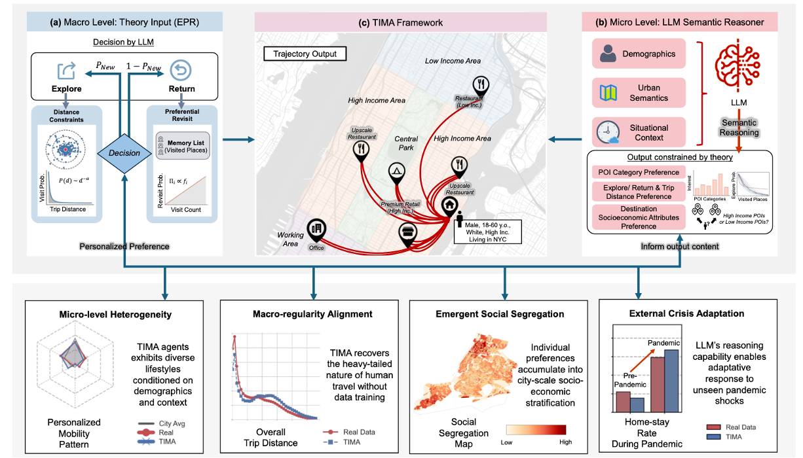

# Theory-Informed Generative Agents for Human Mobility Modeling



## Environment Setup

To set up the environment, install all required dependencies using pip:

```bash
pip install -r requirements.txt
```

## Parameter Setup

Before running the simulation, you need to modify the file paths in `config.yaml` to match your local directory structure. Update the paths in the `paths` section of `config.yaml` to point to your local data directories and files.

## Policy Function Generation

To generate policy function code, run:

```bash
python query_action_code.py
```

This will generate the policy function code that will be used in the simulation.

## TIMA Simulation

After generating the policy function code:

1. Add the path to the generated policy function code file to the `policy_functions` variable in `config.yaml` under the `paths` section.

2. Run the simulation:

```bash
python TIMA_simulation.py
```

This will generate the simulation results based on the configured parameters and policy functions in the `TIMA_simulation_output` folder.
