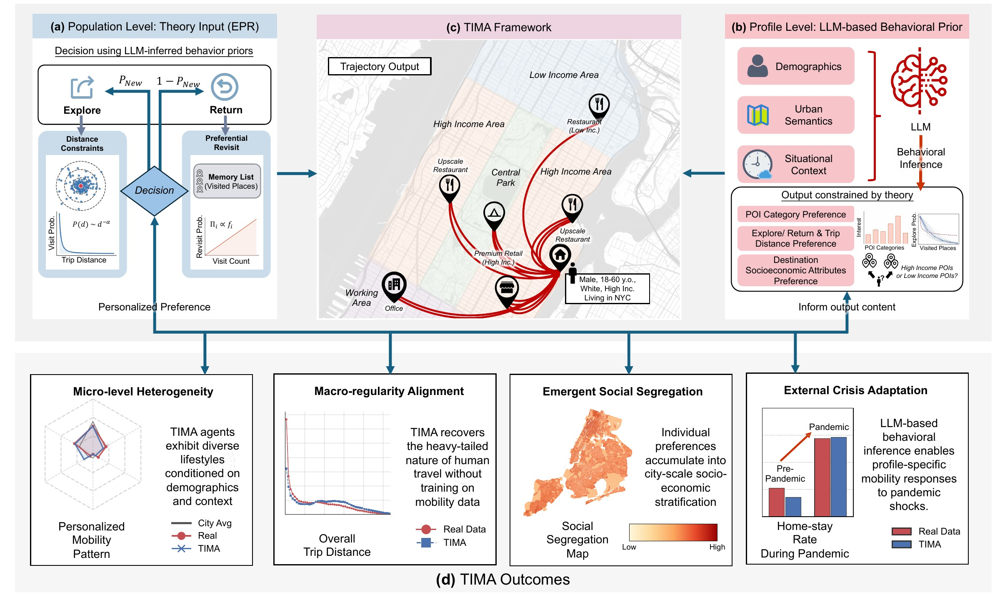

# Coupling Mobility Theory with Large Language Models for Human Mobility Simulation



## Environment Setup

To set up the environment, install all required dependencies using pip:

```bash
pip install -r requirements.txt
```

Installation is expected to take a few minutes, depending on network speed and existing packages.

## Parameter Setup

Configure the selected city's inputs and outputs in `config.yaml` as described under [City-specific Configuration](#city-specific-configuration).

## Population and Agent Initialization

The initialization pipeline generates TIMA agent and CBG profiles for U.S. cities covered by the source datasets, using compatible ACS demographic distributions and CBG-level context from the urban sustainability dataset. Precomputed NYC profiles are available in `agent_initialization/`. Follow the instructions below to initialize a selected city.

### Download the population data

Download these two files using the source links below:

| Source | File to download |
|---|---|
| [SafeGraph Open Census Data](https://docs.safegraph.com/docs/open-census-data), **2019 5-year ACS** | `safegraph_open_census_data_2019.tar.gz` |
| [Urban sustainability dataset, Figshare version 1](https://doi.org/10.6084/m9.figshare.23936787.v1) | `Data_A Satellite Imagery Dataset for Long-Term Sustainable Development in United States Cities.zip` |

The pipeline reads the required tables directly from the archives and saves the selected city's inputs.

### Initialize from the downloaded files

Run the following command from the repository root, replacing the two source paths with your download locations:

```bash
python -m agent_initialization.initialize_agents \
  --acs-source "/path/to/safegraph_open_census_data_2019.tar.gz" \
  --urban-source "/path/to/Data_A Satellite Imagery Dataset for Long-Term Sustainable Development in United States Cities.zip" \
  --city-name "New York city" \
  --city-key NYC \
  --year 2019 \
  --output-dir TIMA_model_input/NYC
```

`--output-dir` specifies where to save the results. `TIMA_model_input/NYC` is an example directory; you can choose another path.

The pipeline selects the city using the urban dataset's `City Name` field and obtains its `CBG Code` values. It then matches those identifiers to Open Census's `census_block_group` field to extract the corresponding demographic records. The selected urban context records are filtered by city, CBG, and year and joined to the demographic inputs.

The output directory contains `cbg_list.csv`, `cbg_extracted_data.csv`, `cbg_context.csv`, `cbg_geographic_data.csv`, `cbg_boundaries.csv`, and the generated agent census and profile JSON files. CBG polygons are extracted from the urban ZIP's `Basic_Geographic_Statistics_CBG.csv` for hotspot evaluation. See [boundary extraction](agent_initialization/README.md#extract-cbg-boundaries) to extract them using only the urban ZIP.

### Initialize another city

Keep the same downloaded archives and change the city selection and output names. For example, replace the last four arguments above with:

```bash
  --city-name "Orlando city" \
  --city-key Orlando \
  --year 2019 \
  --output-dir TIMA_model_input/Orlando
```

`--city-name` must exactly match a city represented in the urban dataset. `--city-key` controls output filenames. The citywide total defaults to an average of 10 agents per CBG and is allocated in proportion to resident population, with at least one agent per CBG. The seed defaults to 42. Change the average and seed with `--agents-per-cbg` and `--seed`; use `--allocation uniform` for fixed-count sensitivity comparisons.

### Use the included NYC population tables

To initialize NYC from the small processed tables already included in the repository:

```bash
python -m agent_initialization.initialize_agents \
  --census-table data/population/NYC/cbg_extracted_data.csv \
  --context-table data/population/NYC/cbg_context.csv \
  --city-key NYC \
  --output-dir TIMA_model_input/NYC
```

### Use the initialized profiles in TIMA

For NYC, the pipeline produces `agent_profiles_NYC.json` and `cbg_profiles_NYC.json` in the chosen output directory. Update the corresponding entries under `paths` in `config.yaml`:

```yaml
paths:
  agent_profiles: TIMA_model_input/NYC/agent_profiles_NYC.json
  cbg_profiles: TIMA_model_input/NYC/cbg_profiles_NYC.json
  cbg_geo_data: TIMA_model_input/NYC/cbg_geographic_data.csv
  cbg_boundaries: TIMA_model_input/NYC/cbg_boundaries.csv
```

The geographic and boundary files above are produced by the archive-based command. When using the included NYC tables, use the geographic and boundary paths in the supplied `config.yaml`. Keep the other configuration entries, supply the corresponding city-specific simulation inputs, and continue with behavioral inference below.

See [population initialization instructions](agent_initialization/README.md) for the four modules, optional CBG selection, and complete output list. The archive-based initialization has been tested for NYC and Orlando.

## City-specific Configuration

After initialization, update `config.yaml` with the selected city's profiles, geographic data, CBG boundaries, POIs, weekly visit data, and matching home-panel summary. Behavioral inference, simulation, and evaluation all read this configuration from the repository root.

For example, after initializing Orlando from the downloaded archives, update the following entries in the existing configuration. Replace the example POI, visit-data, and home-panel paths with your corresponding files, and retain the other settings:

```yaml
simulation:
  city_name: "Orlando"

paths:
  agent_profiles: "TIMA_model_input/Orlando/agent_profiles_Orlando.json"
  cbg_profiles: "TIMA_model_input/Orlando/cbg_profiles_Orlando.json"
  cbg_geo_data: "TIMA_model_input/Orlando/cbg_geographic_data.csv"
  cbg_boundaries: "TIMA_model_input/Orlando/cbg_boundaries.csv"
  poi_data_pattern: "/path/to/Orlando_core_poi.csv"
  weekly_patterns: "/path/to/Orlando_weekly_patterns.csv"
  home_panel_summary: "/path/to/Orlando_home_panel_summary.csv"
  policy_functions: "TIMA_inference_output/Orlando/TIMA_behavior_priors.json"
  output_dir: "TIMA_simulation_output/Orlando"
  output_filename: "agent_movements_llm.jsonl"
```

The input paths determine which city's records are loaded. `simulation.city_name` identifies the city. Use POI and CBG identifiers that match across the profiles, geographic records, POI data, and weekly visit data. The initialization step prepares population and CBG inputs; supply the corresponding POI and visit files separately. The included dummy files provide these inputs for the NYC demonstration.

You can test different opportunity radii using `simulation.d_max_km`. The manuscript experiments use 0.675 km for NYC, 1.0 km for Chicago, and 1.5 km for Orlando and Norfolk–Virginia Beach, with 50 simulation steps and a distance-decay exponent of 2.0. See the manuscript for the exploration and preferential-return equations.

Use a separate `paths.policy_functions` file for each city's behavioral inference and a separate `paths.output_dir` for its simulation results. Then complete behavioral inference, simulation, and evaluation in that order using the commands below.

Evaluation reads the selected city's reference visits from `paths.weekly_patterns` and its simulated trajectories from `paths.output_dir` and `paths.output_filename`. Keep the same city configuration for both stages. The additional home-panel input for Trip Distance KL and POI Proportion KL is described under [Running Evaluation Metrics](#2-running-evaluation-metrics).

## LLM-based Behavioral Inference

Population initialization creates the agent and home-CBG profiles. The same profiles can be used for routine and situational-context runs; the context is applied during behavioral inference, rather than population initialization.

Configure the LLM provider and model in `config.yaml` and the corresponding API key under `api_keys` in your local `secrets.yaml`.

### Routine behavior

Keep the default setting in `config.yaml`:

```yaml
situational_context:
  file: null
```

Then infer profile-conditioned behavioral parameters and rules:

```bash
python query_behavior_priors.py
```

This infers POI-category preferences, socioeconomic affinity weights, and exploration probabilities for each unique demographic profile. The inferred behavioral priors are saved to `TIMA_inference_output/<city>/TIMA_behavior_priors.json`, as specified by `paths.policy_functions` in `config.yaml`, and reused during trajectory simulation. Routine simulation uses the fixed `simulation.alpha` value (2.0 by default).

### Situational context

Routine behavioral-inference inputs and task instructions can be edited directly in [contexts/normal.py](contexts/normal.py).

To infer behavior for a scenario, select its configuration in `config.yaml`:

```yaml
situational_context:
  file: contexts/Manhattan-pandemic/context.json
```

Run `python query_behavior_priors.py` to infer the scenario's POI preferences, socioeconomic affinity weights, exploration probabilities, and distance-decay multiplier. The same initialized population profiles are used. See [context configuration](agent_initialization/README.md#situational-context) for the editable fields and templates. Then run the simulation with the same context selected.

## TIMA Simulation

After completing behavioral inference:

1. Complete [City-specific Configuration](#city-specific-configuration). For routine simulation, use `situational_context.file: null`. For context-specific simulation, set it to the same context JSON used for behavioral inference, such as `contexts/Manhattan-pandemic/context.json`. Leave `paths.policy_functions` at the city's base path; the context-specific prior file is selected automatically.

2. Run the simulation:

```bash
python TIMA_simulation.py
```

This generates trajectories using the saved behavioral priors. Context-specific simulation applies the inferred multiplier to `simulation.alpha`. Routine results are saved under `paths.output_dir`; context-specific results use `<paths.output_dir>/<city>/contexts/<name>/`. Both use `paths.output_filename` from `config.yaml`.

## Runtime

For NYC (64,930 agents; 1,957 unique demographic profiles), behavioral inference with Gemini-2.5-Pro is estimated to take approximately 32.5 minutes with 50 concurrent profile tasks. This estimate uses the measured mean of 49.8 seconds per profile, including retries, and assumes linear parallelization; actual time depends on API rate limits and scheduling. Inferred priors are reused across agents sharing a profile and across simulation runs.

For Orlando (1,440 agents), one 50-step TIMA simulation took approximately 41 seconds on an Apple M4 using six workers and saved behavioral priors.

## Dummy Data for Testing
The full SafeGraph mobility data are subject to licensing restrictions and are not redistributed in this repository. The provided POI and weekly-pattern dummy files use replacement POI identifiers and perturbed coordinates; the home-panel dummy contains synthetic device counts:

- **`data/core_poi/NYC_core_poi_dummy.csv`**: Contains randomized business IDs and jittered coordinates (approx. ±2km offset).
- **`data/Weekly_patterns/..._dummy.csv`**: Uses the corresponding replacement POI IDs to maintain consistency between the files.
- **`data/Weekly_home_panel_summary/..._NYC_dummy.csv`**: Contains synthetic `number_devices_residing` values for the included NYC CBGs, for running the evaluation example.

With the dependencies, LLM credentials, and file paths configured, the supplied population inputs and dummy files support the initialization, behavioral-inference, and trajectory-simulation pipeline, producing JSONL outputs with the schema documented below. Users with authorized access to the corresponding SafeGraph datasets can obtain the files under their applicable data-use agreement, replace the dummy inputs, and update the paths in `config.yaml` to run the pipeline with those data.

## Model Output & Evaluation

### 1. Simulator Output Format
The simulator generates human mobility trajectories in `JSONL` (JSON Lines) format. Each line represents a recorded POI visit by a simulated agent. For privacy and demonstration purposes, POI IDs are masked with dummy identifiers.

**Example Output (`agent_movements_llm.jsonl`):**

```json
{"agent_id": "0", "home_cbg": "360470405001", "time_step": 1, "poi_id": "sg:dummy_poi_0001", "poi_cbg": "360050119002", "category": "Arts, Entertainment, and Recreation", "action": "explore", "dist_km": 15.7696}
{"agent_id": "1", "home_cbg": "360470405001", "time_step": 1, "poi_id": "sg:dummy_poi_0002", "poi_cbg": "360610076002", "category": "Accommodation and Food Services", "action": "explore", "dist_km": 10.016}
{"agent_id": "2", "home_cbg": "360470405001", "time_step": 1, "poi_id": "sg:dummy_poi_0003", "poi_cbg": "360610219001", "category": "Others", "action": "explore", "dist_km": 15.701}
```

*   `agent_id`: Unique identifier for the generative agent.
*   `home_cbg`: The residential Census Block Group of the agent.
*   `action`: Whether the agent is exploring a new location (`explore`) or returning to a familiar one (`return`).
*   **`dist_km`**: The **step distance** from the agent's previous location to the current destination.

Evaluation measures travel distance from the home-CBG centroid to the destination POI.


### 2. Running Evaluation Metrics
`TIMA_analyze.py` calculates macroscopic alignment, fundamental mobility laws, and mobility-mediated social metrics.

**Prerequisites:**
Use the same [city-specific configuration](#city-specific-configuration) as the simulation. Set `paths.weekly_patterns` to the reference visit data and `paths.output_dir` and `paths.output_filename` to the simulation results to evaluate. The script reads the corresponding POI, geographic, profile, and behavioral-rule files from this configuration.

The default configuration includes a dummy home-panel CSV. For empirical evaluation, set `paths.home_panel_summary` to the matching week's home-panel CSV with `census_block_group` and `number_devices_residing` columns. If it is not supplied, these metrics are reported as unavailable (`NaN`). Empirical counts are expanded by home-CBG population divided by resident-device count; simulated events are expanded by home-CBG population divided by its actual initialized agent count. Use the profiles that generated the evaluated trajectories.

**Metrics Calculated:**

*   **Table 1 (Macro Alignment):** Trip Distance KL, tract-level OD Flow CPC, Visits per location KS, POI Proportion KL, and Stratified CPC. CPC measures flow overlap; see [Lenormand et al. (2016)](https://arxiv.org/abs/1506.04889).
*   **Figure 3 (Mobility Laws):** Rank-frequency RMSE for neighborhood profiles with at least five unique locations, Radius of Gyration (Median & KL), and Explorer/Returner comparison ($k^*$ and MAE); see [Pappalardo et al. (2015)](https://doi.org/10.1038/ncomms9166) for mobility-range and explorer/returner characterization.
*   **Social Metrics:** Experienced Segregation ([Zhou and Lu, 2025](https://doi.org/10.1038/s41467-025-66585-z)), home-to-destination income-rank correlation, home-stay rate, and Getis–Ord Gi hotspot overlap ([Getis and Ord, 1992](https://doi.org/10.1111/j.1538-4632.1992.tb00261.x); [Ord and Getis, 1995](https://doi.org/10.1111/j.1538-4632.1995.tb00912.x)). These describe social segregation, income-related destination sorting, home-neighborhood activity, and spatial concentration of visits.
*   **Agent Parameters:** Policy-type summaries of Exploration Probability ($P_u$), POI-category preferences ($w_{u,k}$), and socioeconomic affinity weights ($A_{u,c}$).

Detailed metric definitions are provided in the Supplementary Information and the modules in `evaluation/`.

**Execution:**

```bash
python TIMA_analyze.py --config config.yaml --output metrics.json
```

Gi hotspot evaluation requires CBG polygon boundaries (`paths.cbg_boundaries`) and the matching week's home-panel summary (`paths.home_panel_summary`), using the same city-specific paths configured above.
